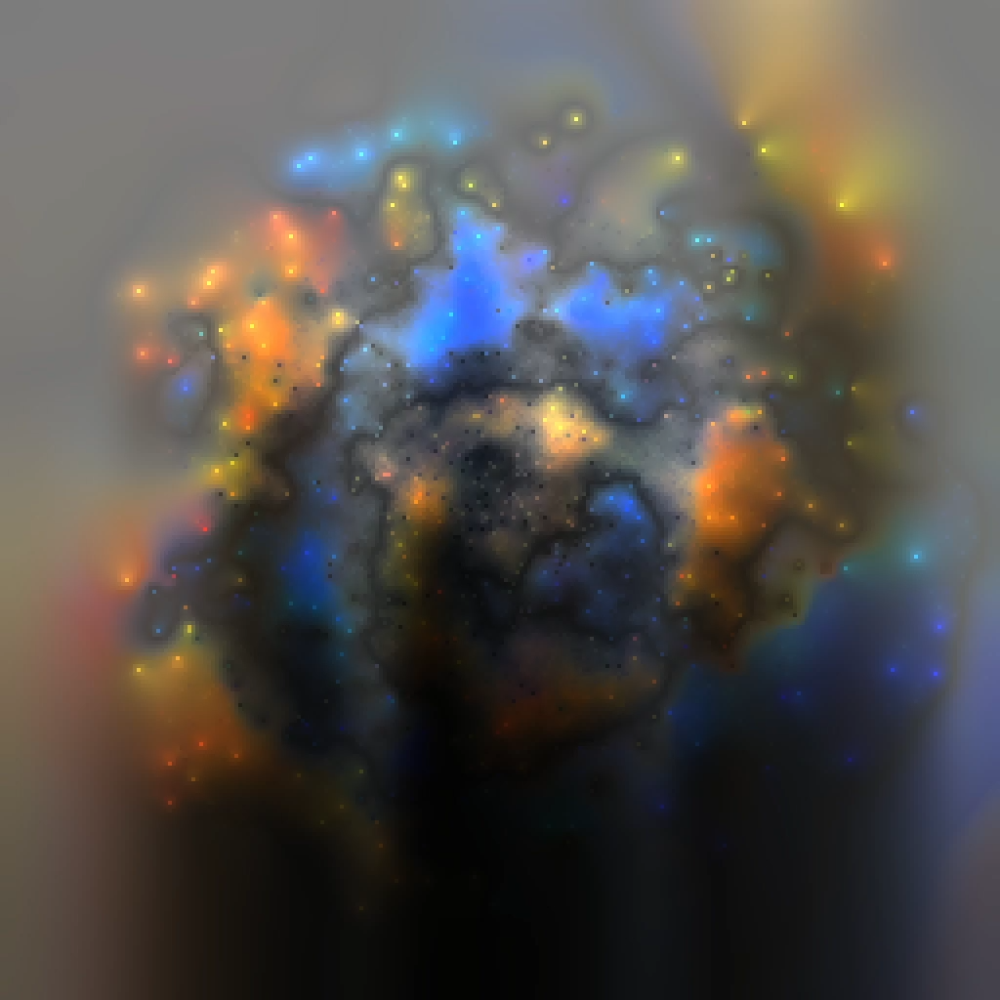

# Cellumetrics
A CPU diffusion and particle simulation rendered with volumetric lighting. It was made using Go and Ebitengine, along with `go-colorful` for a few color conversions. This is my first project in Go, so I kept the scope relatively limited and learned as I went.

	
	

